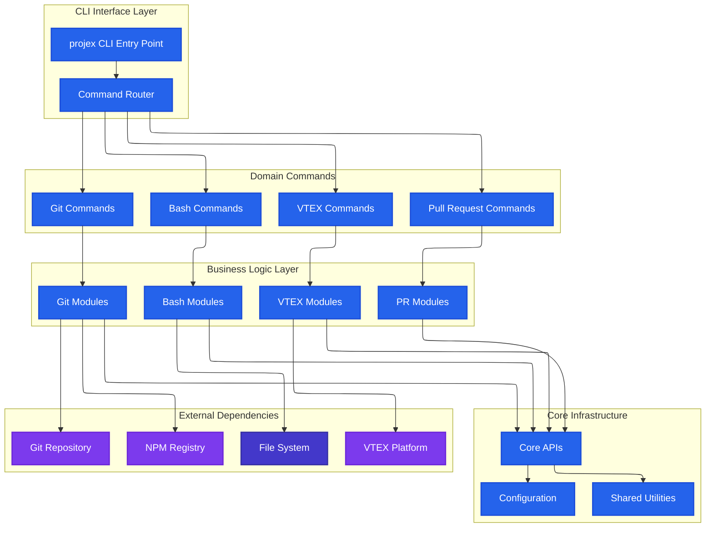
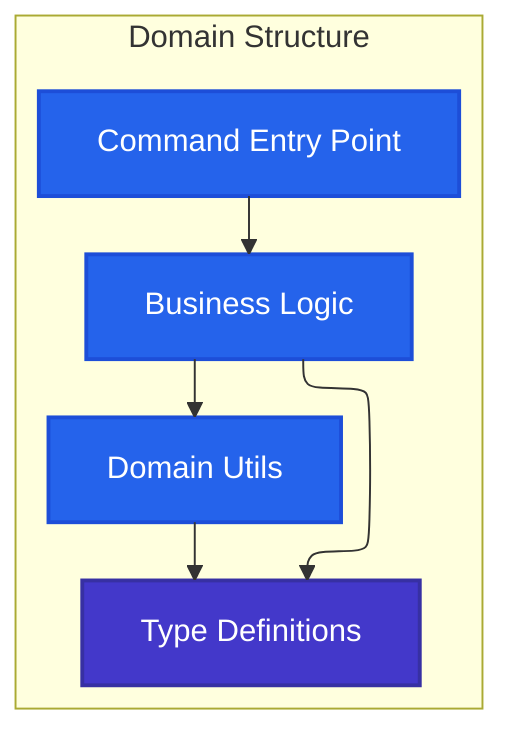
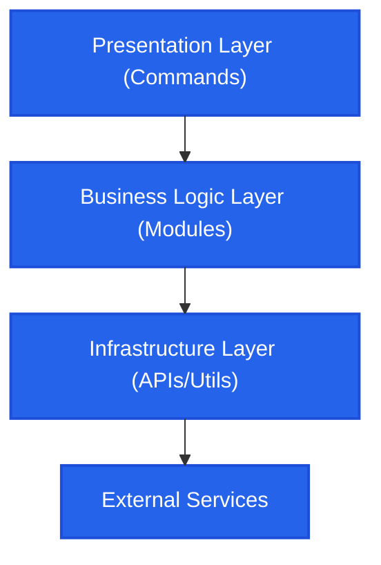
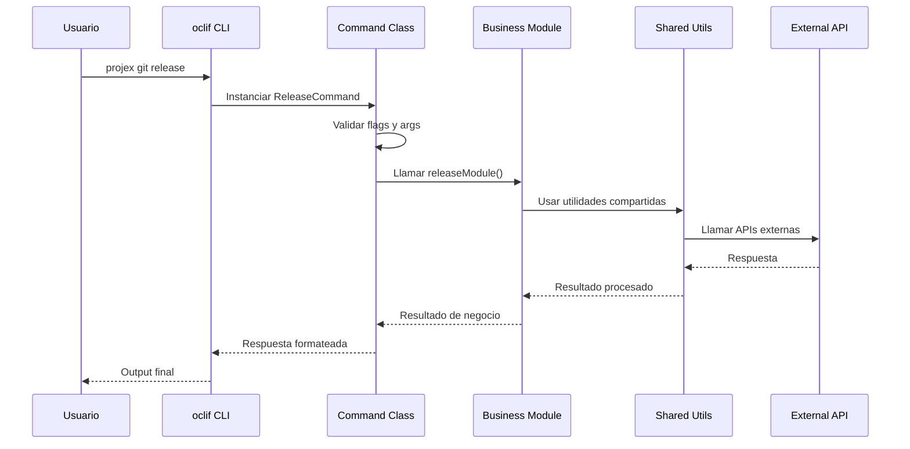
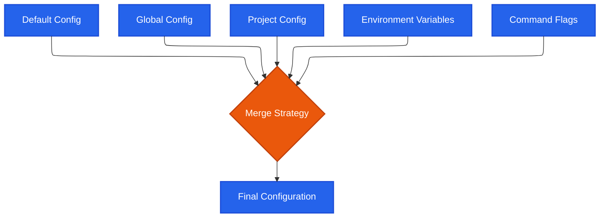
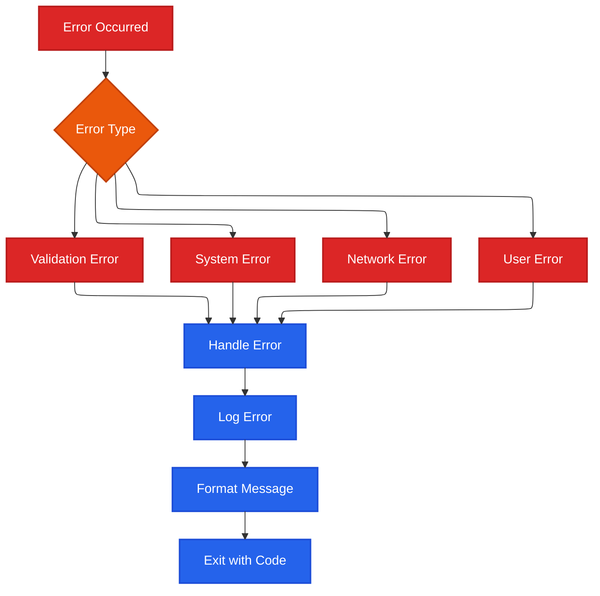
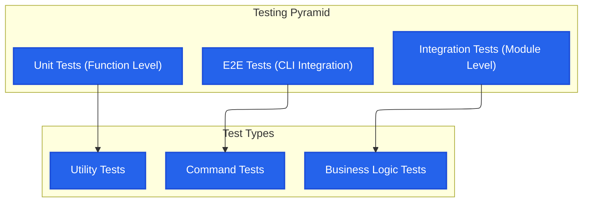
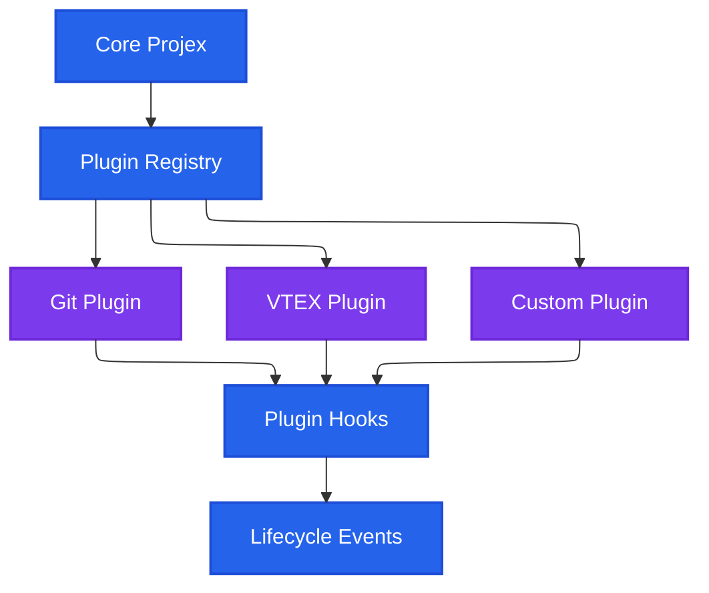

# Architecture Overview

## Descripción

Projex CLI está construido como una aplicación modular basada en [oclif](https://oclif.io/), que proporciona un framework robusto para CLIs de Node.js. La arquitectura sigue principios de separación de responsabilidades, extensibilidad y mantenibilidad.

## Arquitectura de Alto Nivel



## Estructura de Directorios

### Organización del Código Fuente
```
src/
├── commands/              # Comandos CLI (capa de interfaz)
│   ├── bash/
│   ├── git/
│   ├── pull-request/
│   └── vtex/
├── modules/               # Lógica de negocio
│   ├── apps/
│   │   ├── bash/
│   │   ├── git/
│   │   ├── pull-request/
│   │   └── vtex/
│   └── utils.ts
├── api/                   # APIs core y utilidades
│   ├── constants/
│   ├── directory/
│   ├── manifest/
│   ├── modules/
│   └── table/
├── shared/                # Utilidades compartidas
│   ├── constants/
│   ├── models/
│   └── utils/
└── index.ts              # Punto de entrada principal
```

## Principios Arquitectónicos

### 1. Separación por Dominios
Cada dominio (git, vtex, bash, pull-request) tiene su propia estructura:



### 2. Layered Architecture


### 3. Dependency Injection Pattern
```typescript
// Ejemplo de inyección de dependencias
class ReleaseCommand {
  constructor(
    private gitUtils: GitUtils,
    private versionManager: VersionManager,
    private changelogGenerator: ChangelogGenerator
  ) {}

  async execute(options: ReleaseOptions): Promise<void> {
    // Usar dependencias inyectadas
  }
}
```

## Flujo de Datos

### Flujo de Ejecución de Comandos


## Patrones de Diseño Implementados

### 1. Command Pattern
Cada comando CLI implementa el patrón Command:

```typescript
export default class ReleaseCommand extends Command {
  static description = 'Release management command';
  
  async run(): Promise<void> {
    const { args, flags } = await this.parse(ReleaseCommand);
    await this.execute(args, flags);
  }

  private async execute(args: any, flags: any): Promise<void> {
    // Lógica de ejecución
  }
}
```

### 2. Factory Pattern
Para creación de utilidades específicas:

```typescript
class UtilityFactory {
  static createGitUtils(): GitUtils {
    return new GitUtils();
  }

  static createVtexUtils(): VtexUtils {
    return new VtexUtils();
  }
}
```

### 3. Strategy Pattern
Para diferentes estrategias de ejecución:

```typescript
interface ExecutionStrategy {
  execute(command: string, options: any): Promise<Result>;
}

class ParallelExecution implements ExecutionStrategy {
  async execute(command: string, options: any): Promise<Result> {
    // Ejecución paralela
  }
}

class SequentialExecution implements ExecutionStrategy {
  async execute(command: string, options: any): Promise<Result> {
    // Ejecución secuencial
  }
}
```

## Gestión de Configuración

### Jerarquía de Configuración


### Tipos de Configuración
1. **Default**: Configuración por defecto hardcodeada
2. **Global**: ~/.projexrc o configuración global del sistema
3. **Project**: package.json, manifest.json en el proyecto
4. **Environment**: Variables de entorno (PROJEX_*)
5. **Command**: Flags y argumentos de comando

## Error Handling Architecture

### Estrategia de Manejo de Errores


### Códigos de Salida
```typescript
enum ExitCodes {
  SUCCESS = 0,
  GENERIC_ERROR = 1,
  VALIDATION_ERROR = 2,
  NETWORK_ERROR = 3,
  FILE_ERROR = 4,
  GIT_ERROR = 5,
  VTEX_ERROR = 6
}
```

## Testing Architecture

### Estrategia de Testing


### Testing Tools
- **Jest**: Framework principal de testing
- **ts-jest**: Transpilación de TypeScript para tests
- **oclif/test**: Utilidades específicas para testing de CLI
- **Mock FS**: Mocking del sistema de archivos
- **Sinon**: Mocking y stubbing

## Performance Considerations

### Optimizaciones Implementadas
1. **Lazy Loading**: Módulos se cargan solo cuando se necesitan
2. **Command Caching**: Cache de comandos frecuentemente ejecutados
3. **Parallel Execution**: Operaciones independientes en paralelo
4. **Stream Processing**: Archivos grandes procesados en chunks
5. **Debouncing**: Prevención de ejecuciones duplicadas

### Monitoring de Performance
```typescript
// Performance monitoring wrapper
async function withPerformanceMonitoring<T>(
  operation: string,
  fn: () => Promise<T>
): Promise<T> {
  const start = performance.now();
  try {
    const result = await fn();
    const duration = performance.now() - start;
    logger.debug(`${operation} completed in ${duration}ms`);
    return result;
  } catch (error) {
    const duration = performance.now() - start;
    logger.error(`${operation} failed after ${duration}ms:`, error);
    throw error;
  }
}
```

## Security Architecture

### Principios de Seguridad
1. **Input Validation**: Validación estricta de todos los inputs
2. **Command Injection Prevention**: Sanitización de comandos shell
3. **Credential Management**: Manejo seguro de credenciales
4. **File System Security**: Validación de paths y permisos
5. **Network Security**: Validación de URLs y certificados

### Implementación de Seguridad
```typescript
// Input sanitization
function sanitizeShellCommand(command: string): string {
  // Remove potentially dangerous characters
  return command.replace(/[;&|`$]/g, '');
}

// Path validation
function validatePath(path: string): boolean {
  const resolved = path.resolve(path);
  return resolved.startsWith(process.cwd());
}
```

## Extensibility & Plugin System

### Plugin Architecture


### Future Extensibility
- **Custom Commands**: API para registrar comandos personalizados
- **Middleware**: Sistema de middleware para procesar comandos
- **Event System**: Eventos que plugins pueden escuchar
- **Configuration Extensions**: Plugins pueden extender configuración

## Deployment & Distribution

### Build Process


### Distribution Strategy
- **NPM Registry**: Distribución principal a través de npm
- **Global Installation**: Instalación global para uso en cualquier proyecto
- **Local Development**: Linking local para desarrollo
- **CI/CD Integration**: Instalación automática en pipelines

## Monitoring & Observability

### Logging Strategy
- **Structured Logging**: JSON logs para procesamiento automático
- **Log Levels**: DEBUG, INFO, WARN, ERROR
- **Context Preservation**: Información de contexto en todos los logs
- **Performance Metrics**: Timing de operaciones críticas

### Health Monitoring
```typescript
interface HealthStatus {
  status: 'healthy' | 'degraded' | 'unhealthy';
  checks: {
    git: boolean;
    fileSystem: boolean;
    network: boolean;
    dependencies: boolean;
  };
  metrics: {
    uptime: number;
    commandsExecuted: number;
    errorRate: number;
  };
}
```

## Best Practices & Conventions

### Code Standards
1. **TypeScript Strict Mode**: Tipado estricto en todo el código
2. **ESLint + Prettier**: Linting y formateo automático
3. **Conventional Commits**: Estándar de commits
4. **Semantic Versioning**: Versionado semántico
5. **Documentation**: JSDoc en funciones públicas

### Development Workflow
1. **Feature Branches**: Desarrollo en ramas de feature
2. **Code Review**: Review obligatorio antes de merge
3. **Automated Testing**: Tests automáticos en CI/CD
4. **Release Automation**: Releases automáticos con changelog
