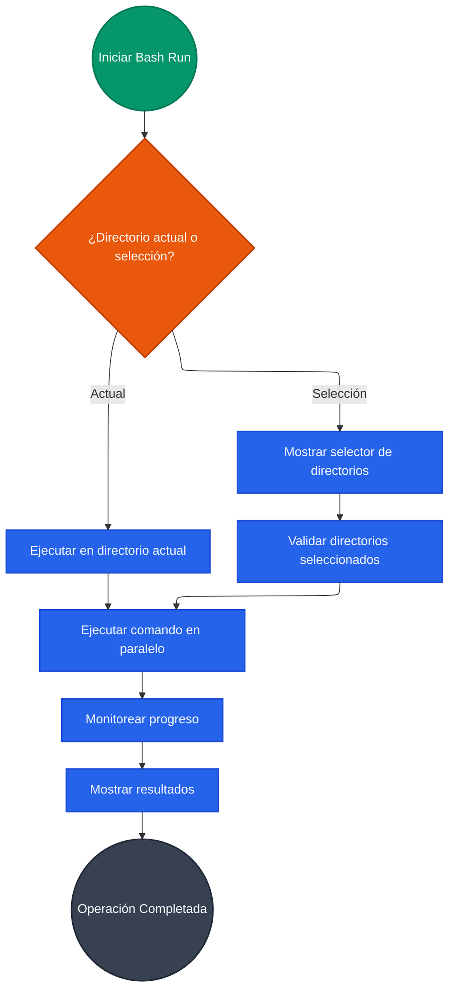
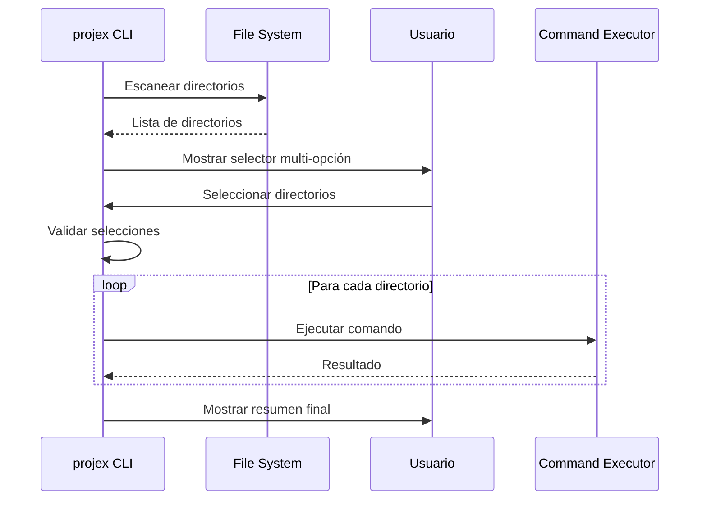
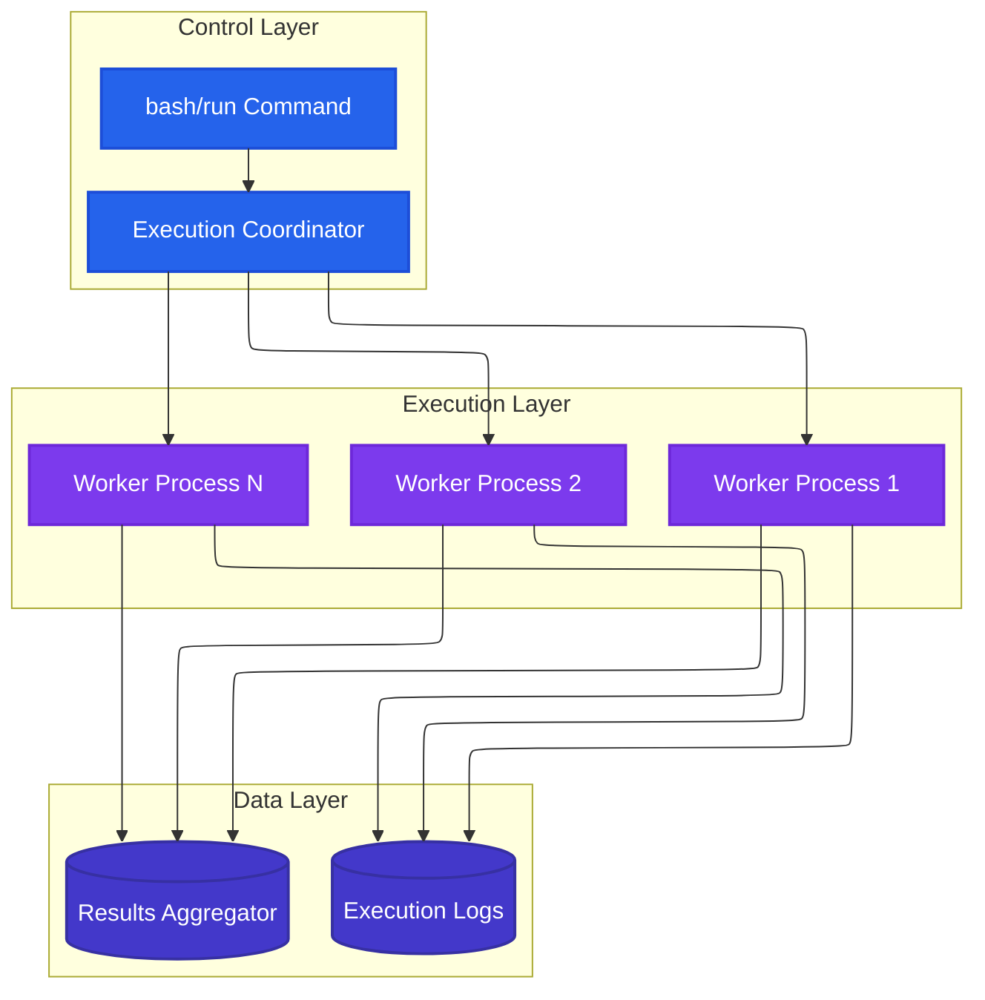
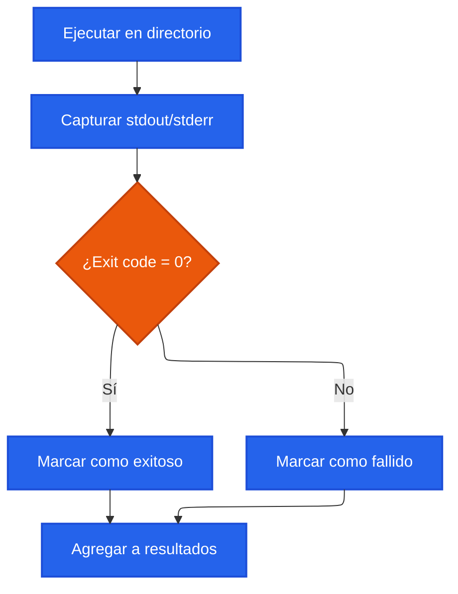
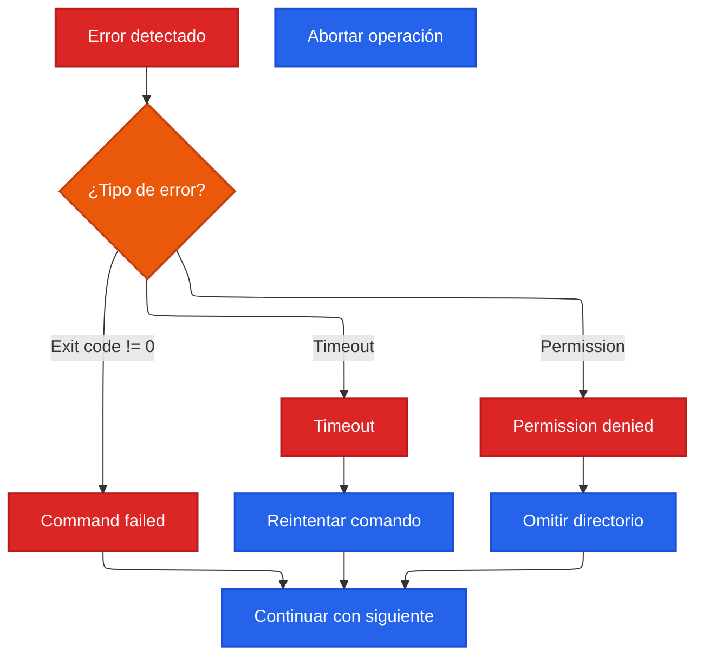

# Bash Automation & Multi-Directory Operations

## Descripción

El módulo de bash automation permite ejecutar comandos de forma masiva en múltiples directorios, proporcionando una interfaz unificada para operaciones batch que es especialmente útil para monorepos, microservicios y gestión de múltiples proyectos.

## Casos de Uso

- **Monorepos**: Ejecutar tests, builds o deploys en múltiples paquetes
- **Microservicios**: Operaciones simultáneas en varios servicios
- **Gestión de dependencias**: Actualización masiva de packages
- **CI/CD batch operations**: Pipelines que afectan múltiples proyectos
- **Maintenance tasks**: Limpieza, auditoría, o refactoring masivo

## Flujo de Ejecución



## Selector de Directorios Interactivo



## Arquitectura de Ejecución Paralela



## Gestión de Resultados

### Agregación de Resultados


### Formato de Salida
```typescript
interface ExecutionResult {
  directory: string;
  command: string;
  success: boolean;
  exitCode: number;
  stdout: string;
  stderr: string;
  duration: number;
}

interface BatchResults {
  totalDirectories: number;
  successCount: number;
  failureCount: number;
  results: ExecutionResult[];
  totalDuration: number;
}
```

## Casos de Uso Comunes

### 1. Testing en Monorepo
```bash
# Ejecutar tests en todos los paquetes
projex bash run "npm test"

# Solo en directorios específicos
projex bash run "npm run test:unit" --select
```

### 2. Actualización de Dependencias
```bash
# Actualizar todas las dependencias
projex bash run "npm update"

# Instalar nueva dependencia en múltiples proyectos
projex bash run "npm install lodash@latest"
```

### 3. Build Pipeline
```bash
# Build todos los proyectos
projex bash run "npm run build"

# Build condicional con validación
projex bash run "npm run build && npm run test"
```

### 4. Maintenance Tasks
```bash
# Limpiar node_modules en todos los proyectos
projex bash run "rm -rf node_modules && npm install"

# Auditoría de seguridad
projex bash run "npm audit --audit-level moderate"
```

## Manejo de Errores y Recuperación

### Estrategias de Error Handling


### Logging y Debugging
```bash
# Ejecución con verbose logging
projex bash run "npm test" --verbose

# Solo mostrar errores
projex bash run "npm build" --quiet

# Guardar logs para análisis posterior
projex bash run "npm audit" --log-file audit-results.log
```

## Optimización de Performance

### Ejecución Paralela Controlada
- **Pool de workers**: Limitar procesos concurrentes según recursos
- **Queue management**: Gestión inteligente de cola de tareas
- **Resource monitoring**: Monitoreo de CPU/memoria durante ejecución

### Configuración de Concurrencia
```json
{
  "bash": {
    "maxConcurrentProcesses": 4,
    "timeoutSeconds": 300,
    "retryAttempts": 2,
    "bailOnFirstError": false
  }
}
```

## Integración con CI/CD

### Pipeline de Testing
```yaml
# GitHub Actions
- name: Run tests in all packages
  run: projex bash run "npm test" --no-select --bail-on-error

- name: Collect coverage reports
  run: projex bash run "npm run coverage:collect"
```

### Deployment Pipeline
```yaml
- name: Build all services
  run: projex bash run "npm run build:prod"

- name: Deploy services individually
  run: projex bash run "npm run deploy" --max-concurrent 2
```

## Mejores Prácticas

### Diseño de Comandos
1. **Idempotencia**: Comandos que pueden ejecutarse múltiples veces
2. **Fast fail**: Detección temprana de errores críticos
3. **Atomicidad**: Operaciones que se completan o fallan completamente
4. **Logging consistente**: Formato uniforme de salida

### Gestión de Recursos
1. **Límites de concurrencia**: Evitar saturar el sistema
2. **Timeouts apropiados**: Prevenir procesos colgados
3. **Cleanup automático**: Limpieza de recursos al finalizar
4. **Memory management**: Monitoreo de uso de memoria

### Monitoreo y Observabilidad
1. **Métricas de ejecución**: Tiempo, éxito/fallo por directorio
2. **Alertas de fallos**: Notificación de errores críticos
3. **Dashboards**: Visualización de resultados agregados
4. **Audit trails**: Registro completo de operaciones

## Troubleshooting

### Problemas Comunes

**Procesos Colgados**
```bash
# Usar timeout para prevenir
timeout 300s projex bash run "npm test"

# Monitorear procesos activos
ps aux | grep node
```

**Memory Issues**
```bash
# Reducir concurrencia
projex bash run "npm test" --max-concurrent 2

# Monitorear memoria
free -h && projex bash run "npm build"
```

**Permission Problems**
```bash
# Verificar permisos antes de ejecutar
find . -name package.json -not -readable

# Ejecutar con permisos apropiados
sudo projex bash run "npm install -g package"
```

### Debugging Avanzado

**Trace de Ejecución**
```bash
# Habilitar trace completo
DEBUG=projex:bash projex bash run "npm test"

# Solo errores críticos
PROJEX_LOG_LEVEL=error projex bash run "npm build"
```

**Análisis Post-ejecución**
```bash
# Generar reporte detallado
projex bash run "npm audit" --report-format json > audit-report.json

# Análizar fallos
jq '.results[] | select(.success == false)' results.json
```
