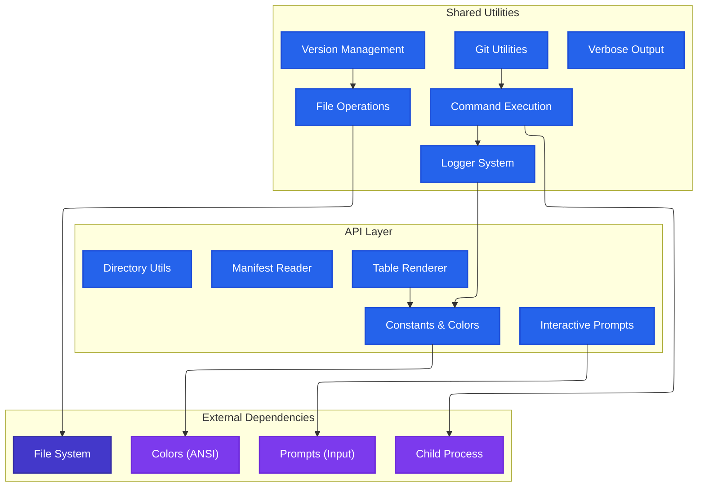
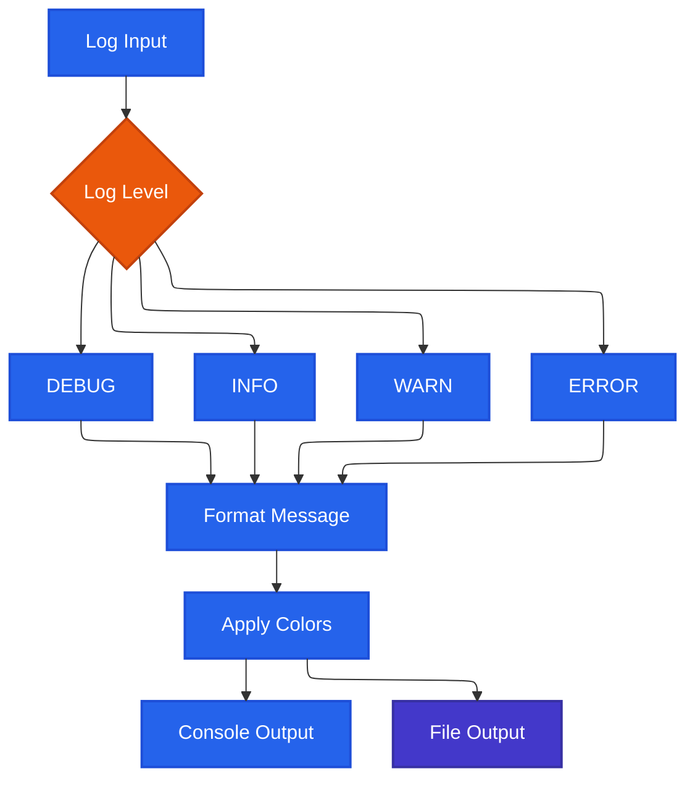
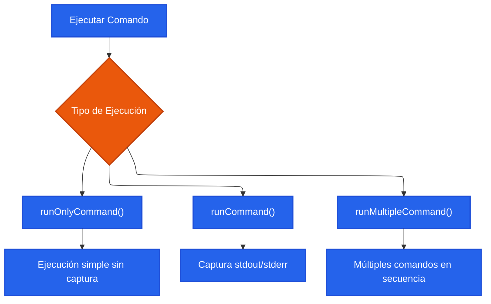
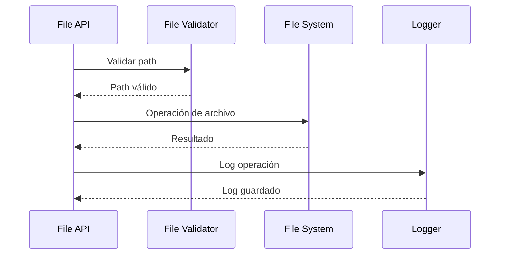
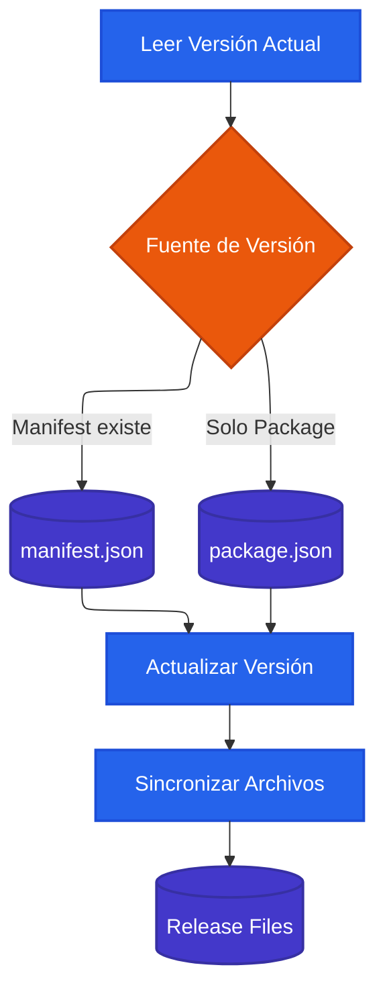
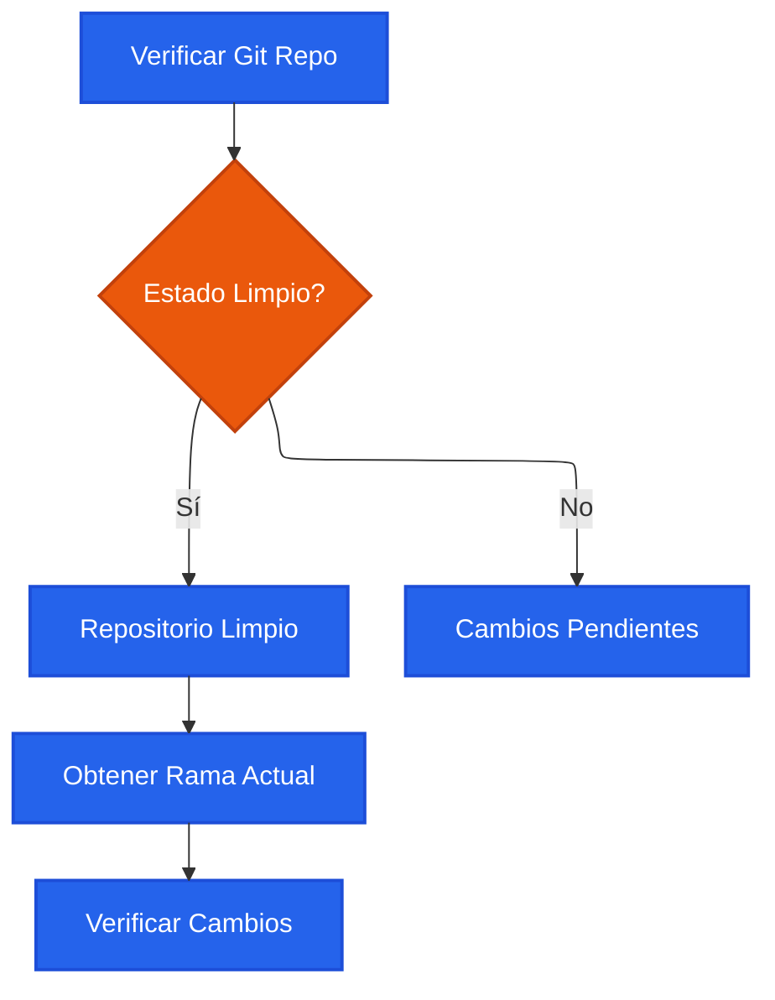
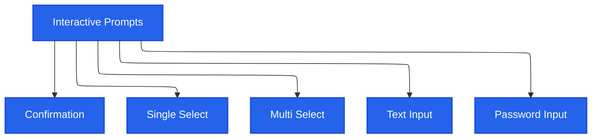
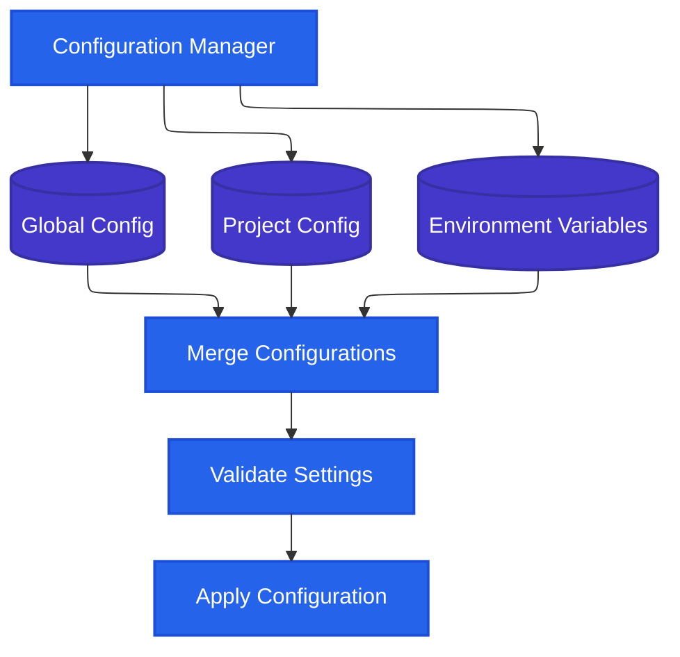

# Core APIs & Utilities

## Descripción

Las APIs y utilidades core de projex-toolbet proporcionan la infraestructura fundamental para todos los comandos, incluyendo manejo de archivos, ejecución de comandos, logging, validaciones, y utilidades compartidas que mantienen la consistencia y calidad del código.

## Arquitectura de Módulos Core



## Sistema de Logging

### Arquitectura de Logging


### Configuración de Colores
```typescript
// src/api/constants/colors-chalk.ts
export class Colors {
  public static readonly GREEN = (msg: string) => /* ... */;
  public static readonly ERROR = (msg: string) => /* ... */;
  public static readonly YELLOW = (msg: string) => /* ... */;
  // ...otros colores
}

// Uso en comandos
console.log(Colors.GREEN('✅ Operation completed'));
console.log(Colors.ERROR('❌ Error occurred'));
console.log(Colors.YELLOW('⚠️ Warning message'));
```

## Sistema de Ejecución de Comandos

### Tipos de Ejecución


### API de Ejecución de Comandos
```typescript
// Ejecución simple
await runOnlyCommand('npm install', { verbose: true });

// Captura de output
const result = await runCommand('git status --porcelain');
if (result.success) {
  console.log('Git output:', result.stdout);
}

// Múltiples comandos
await runMultipleCommand([
  'npm run build',
  'npm run test',
  'npm run deploy'
], { stopOnError: true });
```

## Sistema de Gestión de Archivos

### Operaciones de Archivos


### Utilidades de Archivos
```typescript
// src/shared/utils/files.ts

// Verificar existencia
const exists = await fileExists('package.json');

// Leer contenido
const content = await readFileContent('manifest.json');

// Escribir archivo
await writeFileContent('output.json', JSON.stringify(data));

// Crear directorio
await ensureDirectory('./dist/assets');

// Copiar archivos
await copyFile('template.md', 'new-file.md');

// Obtener información de archivo
const stats = await getFileStats('large-file.zip');
console.log(`Size: ${stats.size} bytes`);
```

## Sistema de Versionado

### Gestión de Versiones


### API de Versionado
```typescript
// src/shared/utils/versionFile.ts

// Obtener versión actual
const currentVersion = await getCurrentVersion();
console.log(`Current version: ${currentVersion}`);

// Bump versión
const newVersion = await bumpVersion('patch'); // patch, minor, major
console.log(`New version: ${newVersion}`);

// Actualizar archivos adicionales
await updateReleaseFiles(newVersion);

// Validar consistencia
const isConsistent = await validateVersionConsistency();
```

## Sistema de Validaciones Git

### Utilidades Git


### API Git
```typescript
// src/shared/utils/git.ts

// Verificar si es repositorio Git
const isGitRepo = await checkGitRepository();

// Obtener rama actual
const branch = await getCurrentBranch();
console.log(`Current branch: ${branch}`);

// Verificar cambios pendientes
const hasChanges = await hasUncommittedChanges();
if (hasChanges) {
  console.log('Warning: Uncommitted changes detected');
}

// Obtener último commit
const lastCommit = await getLastCommitHash();

// Verificar si hay commits para push
const hasPendingCommits = await hasPendingPushCommits();
```

## Sistema de Prompts Interactivos

### Tipos de Prompts


### API de Prompts
```typescript
// src/shared/utils/prompts.ts

// Confirmación simple
const proceed = await confirmPrompt('Continue with deployment?');

// Selección única
const environment = await selectPrompt('Select environment:', [
  'development',
  'staging', 
  'production'
]);

// Selección múltiple
const features = await multiSelectPrompt('Select features to enable:', [
  'authentication',
  'analytics',
  'monitoring'
]);

// Input de texto
const projectName = await inputPrompt('Enter project name:');

// Input de password
const apiKey = await passwordPrompt('Enter API key:');
```

## Sistema de Renderizado de Tablas

### Configuración de Tablas
```typescript
// src/api/table/table.ts

interface TableColumn {
  key: string;
  header: string;
  width?: number;
  align?: 'left' | 'center' | 'right';
  color?: (value: any) => string;
}

// Crear tabla
const table = new ProjectTable({
  columns: [
    { key: 'name', header: 'Name', width: 20 },
    { key: 'status', header: 'Status', color: statusColor },
    { key: 'duration', header: 'Duration', align: 'right' }
  ]
});

// Agregar datos
table.addRow({ name: 'Build', status: 'success', duration: '2.3s' });
table.addRow({ name: 'Test', status: 'failed', duration: '0.8s' });

// Renderizar
table.render();
```

## Sistema de Configuración

### Gestión de Configuración


## Mejores Prácticas de Desarrollo

### Estructura de Módulos
1. **Separación de responsabilidades**: Cada módulo tiene una función específica
2. **APIs consistentes**: Interfaces uniformes entre módulos
3. **Error handling**: Manejo robusto de errores en todos los niveles
4. **Testing**: Cobertura completa de utilidades core

### Convenciones de Código
```typescript
// Naming conventions
interface ProjectConfig {
  name: string;
  version: string;
  settings: ProjectSettings;
}

// Error handling
try {
  const result = await executeOperation();
  return { success: true, data: result };
} catch (error) {
  logger.error('Operation failed:', error);
  return { success: false, error: error.message };
}

// Async/await patterns
async function processFiles(files: string[]): Promise<ProcessResult[]> {
  const results = await Promise.all(
    files.map(file => processFile(file))
  );
  return results;
}
```

### Performance Optimization
1. **Lazy loading**: Cargar módulos solo cuando se necesitan
2. **Caching**: Cache de operaciones costosas
3. **Streaming**: Procesar archivos grandes en chunks
4. **Parallelization**: Ejecutar operaciones independientes en paralelo

## Testing de Utilidades Core

### Estructura de Tests
```typescript
// utils.test.ts
describe('File Utilities', () => {
  test('should read file content correctly', async () => {
    const content = await readFileContent('test-file.txt');
    expect(content).toBe('expected content');
  });

  test('should handle file not found error', async () => {
    await expect(readFileContent('nonexistent.txt'))
      .rejects.toThrow('File not found');
  });
});

describe('Git Utilities', () => {
  test('should detect git repository', async () => {
    const isRepo = await checkGitRepository();
    expect(isRepo).toBe(true);
  });
});
```

### Mocking y Testing
```typescript
// Mock file system operations
jest.mock('fs/promises', () => ({
  readFile: jest.fn(),
  writeFile: jest.fn(),
  access: jest.fn()
}));

// Mock command execution
jest.mock('../utils/runCommand', () => ({
  runCommand: jest.fn().mockResolvedValue({
    success: true,
    stdout: 'mocked output'
  })
}));
```

## Debugging y Troubleshooting

### Debug Utilities
```typescript
// Debug logging
import { debug } from '../shared/logger';

debug('Processing file: %s', filename);
debug('Config loaded: %O', config);

// Performance monitoring
const start = performance.now();
await expensiveOperation();
const duration = performance.now() - start;
debug('Operation completed in %dms', duration);
```

### Common Issues
1. **Path resolution**: Usar path.resolve() para paths absolutos
2. **Async operations**: Manejar correctamente Promises y async/await
3. **Error propagation**: No silenciar errores, propagarlos apropiadamente
4. **Resource cleanup**: Cerrar streams y connections

## Extensibilidad

### Plugin System
```typescript
interface ProjectPlugin {
  name: string;
  version: string;
  init(context: PluginContext): Promise<void>;
  execute(args: any[]): Promise<PluginResult>;
}

// Registrar plugin
registerPlugin(new CustomPlugin());

// Ejecutar plugin
await executePlugin('custom-plugin', args);
```

### Custom Utilities
```typescript
// Extender utilidades existentes
class CustomFileUtils extends BaseFileUtils {
  async processSpecialFormat(file: string): Promise<any> {
    // Custom implementation
  }
}

// Usar en comandos
const fileUtils = new CustomFileUtils();
await fileUtils.processSpecialFormat('data.custom');
```
