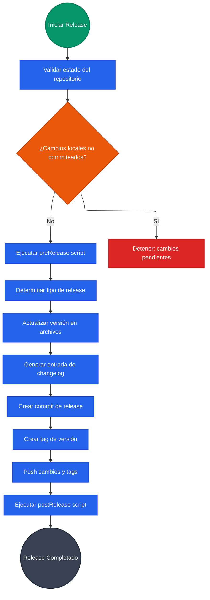
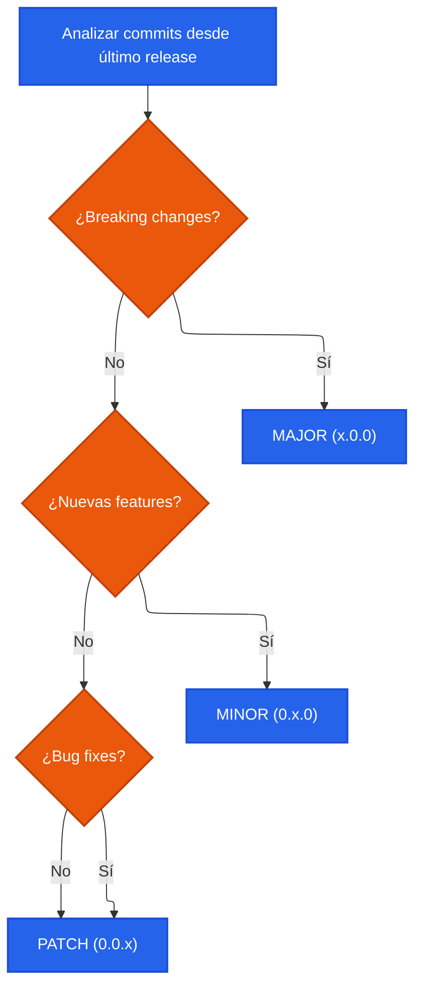
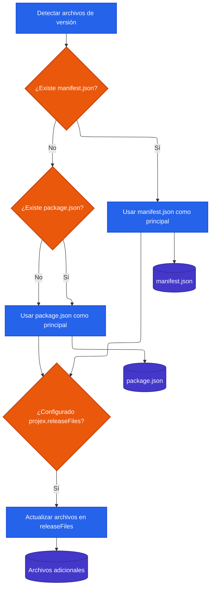
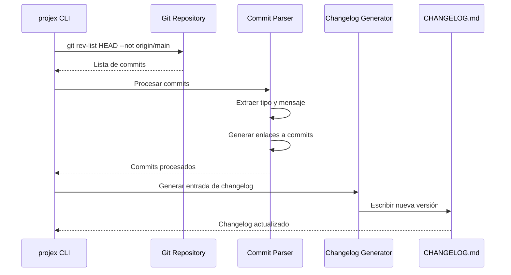
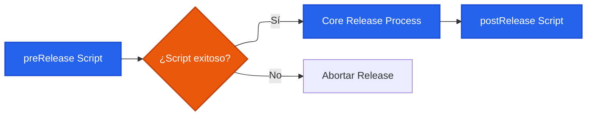

# Git Release Management

## Descripción

El sistema de release management de projex-toolbet automatiza completamente el proceso de versionado, desde el bump de versión hasta la actualización del changelog y la publicación, siguiendo las mejores prácticas de [Semantic Versioning](https://semver.org/) y [Keep a Changelog](https://keepachangelog.com/).

## Casos de Uso

- **Releases automatizados** para proyectos con múltiples desarrolladores
- **Versionado consistente** siguiendo semantic versioning
- **Changelog automático** basado en commits convencionales
- **CI/CD integration** para publicación automática
- **Múltiples archivos de versión** sincronizados automáticamente

## Flujo de Release



## Algoritmo de Determinación de Versión



## Estructura de Archivos de Versión

### Configuración en package.json
```json
{
  "version": "1.43.1",
  "projex": {
    "releaseFiles": [
      "library/package.json",
      "react/package.json", 
      "node/package.json"
    ]
  }
}
```

### Detección de Archivos de Versión


## Generación de Changelog

### Formato del Changelog
Siguiendo [Keep a Changelog](https://keepachangelog.com/):

```markdown
# Changelog

## [Unreleased]

## [1.43.1](https://github.com/user/repo/compare/v1.43.0...v1.43.1) - (2025-06-12)

### Bug Fixes
* fix the build version ([e14dca1c](https://github.com/user/repo/commit/e14dca1c))

### Features  
* add new feature ([5ef6405f](https://github.com/user/repo/commit/5ef6405f))
```

### Procesamiento de Commits


## Integración con Scripts

### Pre/Post Release Scripts
En `manifest.json`:
```json
{
  "scripts": {
    "preRelease": "npm run test && npm run build",
    "postRelease": "npm publish && git push --follow-tags"
  }
}
```

### Flujo de Ejecución de Scripts


## Configuración de Tags

### Estrategias de Tagging
- **stable**: Para releases de producción
- **beta**: Para releases de prueba
- **hkignore**: Para releases internos/desarrollo

### Formato de Tags
```
v1.43.1-beta
v1.43.1-stable
v1.43.1-hkignore
```

## Casos de Uso Avanzados

### Release Automático en CI/CD
```yaml
# GitHub Actions
name: Release
on:
  push:
    branches: [main]

jobs:
  release:
    runs-on: ubuntu-latest
    steps:
      - uses: actions/checkout@v3
      - name: Release
        run: projex git release --yes --no-check-release
```

### Release Manual con Validación
```bash
# Release interactivo con todas las validaciones
projex git release

# Release específico
projex git release minor stable

# Release sin push (para revisión)
projex git release --no-push
```

## Troubleshooting

### Problemas Comunes

1. **Cambios no commiteados**: Use `--no-check-release` o haga commit antes
2. **Archivos de versión no encontrados**: Verifique rutas en `projex.releaseFiles`
3. **Scripts fallando**: Use `--no-pre-release` o `--no-post-release` para omitir
4. **Conflictos de merge**: Resuelva antes de hacer release

### Debugging
```bash
# Ver información de versión actual
projex git release --get-version

# Solo obtener número de versión
projex git release --get-only-version-number

# Verbose para debugging
projex git release --verbose
```

## Mejores Prácticas

1. **Commits Convencionales**: Use conventional commits para mejor detección automática
2. **Testing**: Configure preRelease scripts para ejecutar tests
3. **Changelog Manual**: Mantenga sección [Unreleased] actualizada
4. **Backup**: Siempre haga backup antes de releases importantes
5. **Staging**: Use tags beta para validar antes de stable
