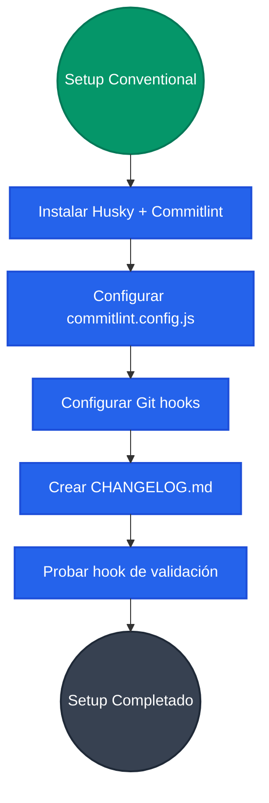
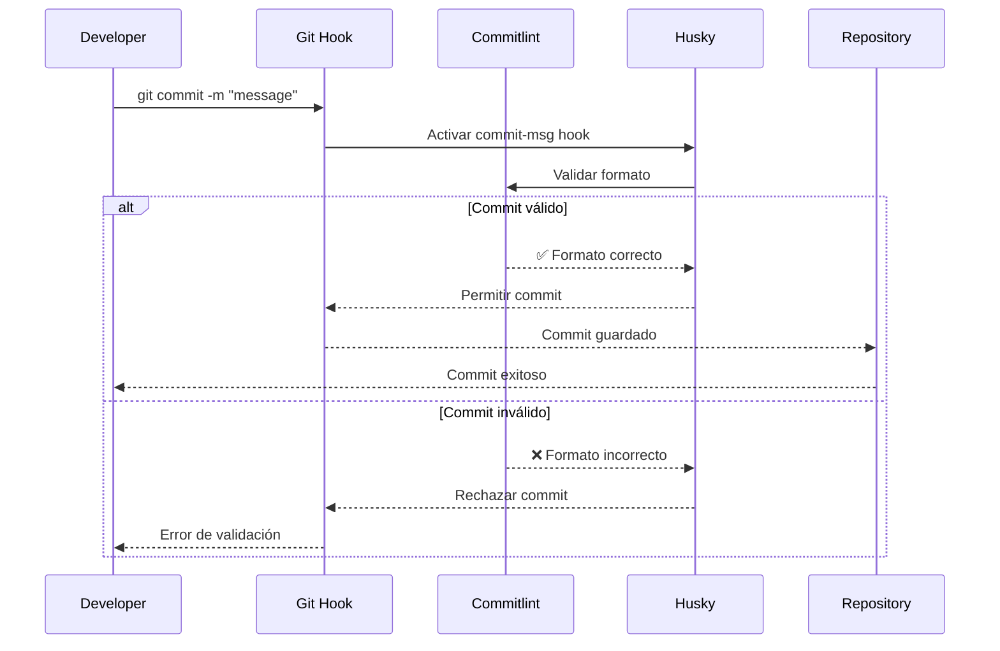
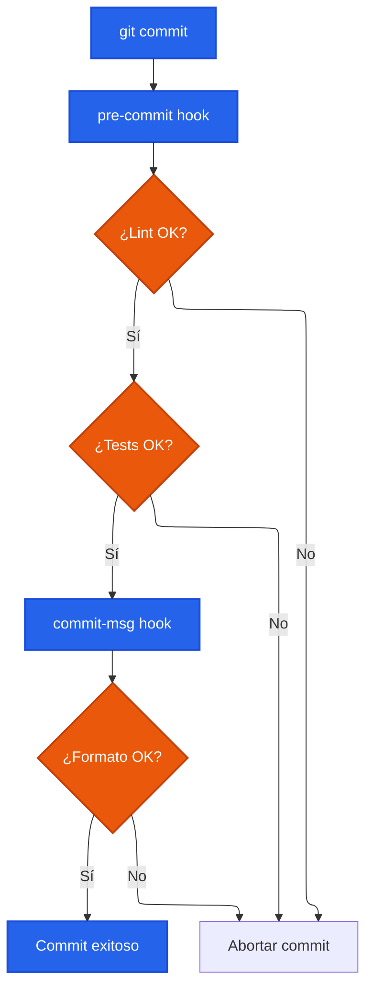
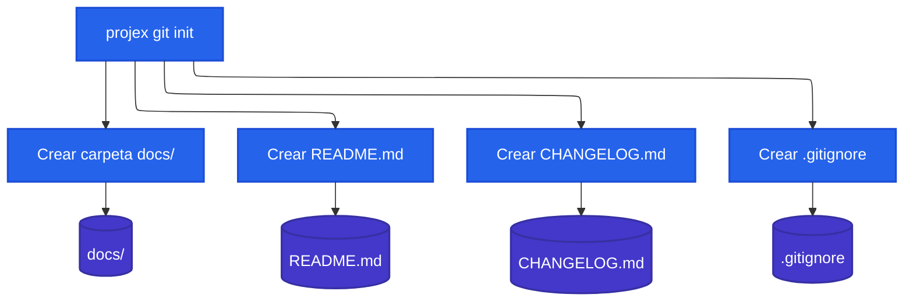
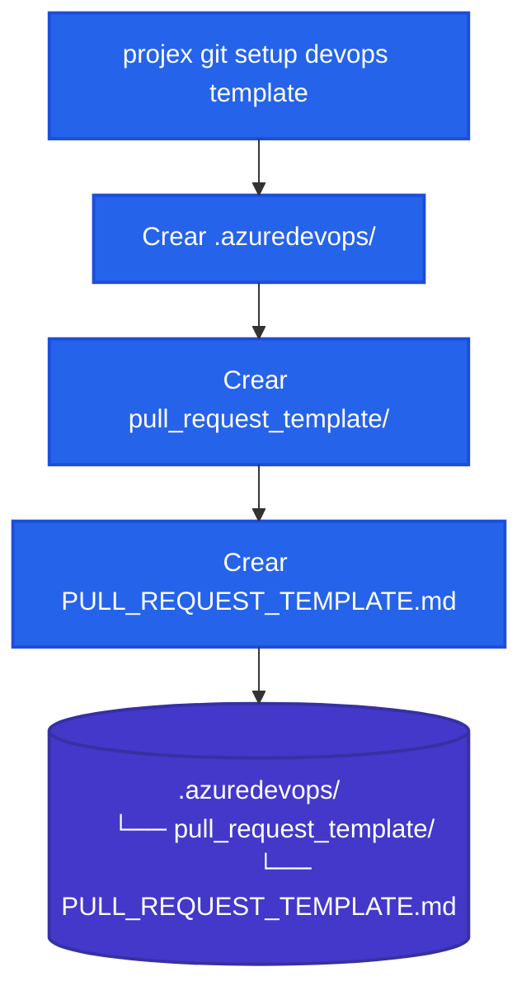
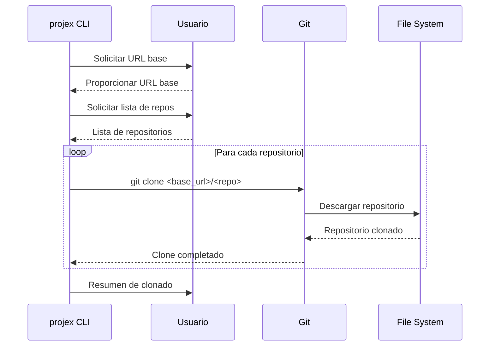

# Git Setup & Conventional Commits

## Descripción

El sistema de setup de Git automatiza la configuración de conventional commits, hooks de Husky, validación con Commitlint, y templates para DevOps, proporcionando una base sólida para equipos que siguen mejores prácticas de desarrollo colaborativo.

## Casos de Uso

- **Onboarding de equipos** con configuración estándar de Git
- **Enforcement de conventional commits** en repositorios colaborativos
- **Automatización de changelog** basado en commits estructurados
- **Templates de DevOps** para Azure DevOps y GitHub
- **Hooks de pre-commit** para validación de calidad

## Arquitectura de Conventional Commits



## Sistema de Validación de Commits



## Estructura de Conventional Commits

### Formato Estándar
```
<type>[optional scope]: <description>

[optional body]

[optional footer(s)]
```

### Tipos de Commit Soportados
```mermaid
%%{init: { "flowchart": { "defaultRenderer": "elk" } } }%%
flowchart TB
    classDef statementClass fill:#2563eb,color:white,stroke:#1d4ed8,stroke-width:2px

    commits["Conventional Commits"]:::statementClass
    
    feat["feat: Nueva funcionalidad"]:::statementClass
    fix["fix: Corrección de bugs"]:::statementClass
    docs["docs: Documentación"]:::statementClass
    style["style: Formato/estilo"]:::statementClass
    refactor["refactor: Refactoring"]:::statementClass
    test["test: Tests"]:::statementClass
    chore["chore: Mantenimiento"]:::statementClass
    perf["perf: Performance"]:::statementClass
    ci["ci: CI/CD"]:::statementClass

    commits --> feat
    commits --> fix
    commits --> docs
    commits --> style
    commits --> refactor
    commits --> test
    commits --> chore
    commits --> perf
    commits --> ci
```

## Configuración de Commitlint

### commitlint.config.js
```javascript
module.exports = {
  extends: ['@commitlint/config-conventional'],
  rules: {
    'type-enum': [
      2,
      'always',
      [
        'feat',     // Nueva funcionalidad
        'fix',      // Corrección de bugs
        'docs',     // Documentación
        'style',    // Formato, punto y coma, etc
        'refactor', // Refactoring de código
        'test',     // Agregar tests
        'chore',    // Mantenimiento
        'perf',     // Mejoras de performance
        'ci',       // Cambios en CI/CD
        'build',    // Cambios en build system
        'revert'    // Revertir commits
      ]
    ],
    'scope-case': [2, 'always', 'lower-case'],
    'subject-case': [2, 'always', 'lower-case'],
    'subject-empty': [2, 'never'],
    'subject-full-stop': [2, 'never', '.'],
    'header-max-length': [2, 'always', 72]
  }
};
```

## Sistema de Hooks de Git

### Flujo de Hooks Husky


### Configuración de Hooks
```json
{
  "husky": {
    "hooks": {
      "pre-commit": "lint-staged",
      "commit-msg": "commitlint -E HUSKY_GIT_PARAMS",
      "pre-push": "npm run test"
    }
  },
  "lint-staged": {
    "*.{js,ts,tsx}": [
      "eslint --fix",
      "prettier --write",
      "git add"
    ],
    "*.{md,json}": [
      "prettier --write",
      "git add"
    ]
  }
}
```

## Inicialización de Repositorio

### Flujo de `projex git init`


### Archivos Creados por Defecto

**README.md Template**
```markdown
# Project Name

## Description
Brief description of your project.

## Installation
```bash
npm install
```

## Usage
```bash
npm start
```

## Contributing
Please read our contributing guidelines.
```

**CHANGELOG.md Template**
```markdown
# Changelog

All notable changes to this project will be documented in this file.

The format is based on [Keep a Changelog](http://keepachangelog.com/en/1.0.0/)
and this project adheres to [Semantic Versioning](http://semver.org/spec/v2.0.0.html).

## [Unreleased]
```

**.gitignore Template**
```
# Dependencies
node_modules/
npm-debug.log*
yarn-debug.log*
yarn-error.log*

# Build outputs
dist/
build/
*.tsbuildinfo

# Environment
.env
.env.local
.env.development.local
.env.test.local
.env.production.local

# IDE
.vscode/
.idea/
*.swp
*.swo

# OS
.DS_Store
Thumbs.db
```

## Templates de DevOps

### Azure DevOps Pull Request Template


### Template de Pull Request
```markdown
## 🎯 What problem is this solving?
Brief description of the issue this PR addresses.

## 🔧 How to test it?
Step-by-step instructions to test the changes.

## 📸 Screenshots or example usage
If applicable, add screenshots or examples.

## 🤔 Describe alternatives you've considered
Alternative approaches that were considered.

## 🔗 Related to / Depends on
Link to related issues or dependencies.

## 🎭 How does this PR make you feel?
Add a GIF that represents your feelings about this PR.
```

## Clonado Masivo de Repositorios

### Flujo de `projex git clone`


### Casos de Uso del Clonado
```bash
# Clonar múltiples repositorios de una organización
projex git clone 'https://github.com/myorg/' 'repo1,repo2,repo3'

# Clonar con estructura específica
projex git clone 'https://dev.azure.com/org/project/_git/' 'frontend,backend,shared'
```

## Integración con CI/CD

### Validación en Pipeline
```yaml
# GitHub Actions
name: Validate Commits
on: [push, pull_request]

jobs:
  validate:
    runs-on: ubuntu-latest
    steps:
      - uses: actions/checkout@v3
        with:
          fetch-depth: 0
          
      - name: Validate Commit Messages
        run: |
          npm install -g @commitlint/cli @commitlint/config-conventional
          npx commitlint --from origin/main --to HEAD --verbose
```

### Automatización de Setup
```yaml
# Setup automático en nuevo proyecto
- name: Setup Git Conventions
  run: |
    npm install -g projex
    projex git init
    projex git setup conventional
    git add .
    git commit -m "chore: setup conventional commits and project structure"
```

## Mejores Prácticas

### Mensajes de Commit Efectivos
1. **Claridad**: Describe qué hace el cambio, no cómo lo hace
2. **Consistencia**: Usar siempre el mismo formato
3. **Brevedad**: Header de máximo 72 caracteres
4. **Contexto**: Incluir scope cuando sea relevante

### Ejemplos de Buenos Commits
```bash
# Feature con scope
feat(auth): add OAuth2 integration for Google login

# Fix con contexto
fix(api): resolve null pointer exception in user validation

# Breaking change
feat!: migrate to new authentication system

BREAKING CHANGE: Auth API endpoints have changed structure
```

### Configuración de Equipo
1. **Onboarding**: Documentar proceso de setup
2. **Training**: Capacitar en conventional commits
3. **Enforcement**: Usar hooks obligatorios
4. **Review**: Revisar formato en code review

## Troubleshooting

### Problemas Comunes

**Hook no se ejecuta**
```bash
# Verificar instalación de Husky
ls -la .git/hooks/

# Reinstalar hooks
npx husky install
```

**Commitlint falla**
```bash
# Verificar configuración
npx commitlint --help-config

# Test manual
echo "feat: test message" | npx commitlint
```

**Mensajes rechazados**
```bash
# Ver reglas específicas
npx commitlint --print-config

# Validar mensaje específico
npx commitlint --edit .git/COMMIT_EDITMSG
```

### Debugging Avanzado
```bash
# Habilitar debug de Husky
DEBUG=husky git commit -m "test"

# Verbose output de commitlint
npx commitlint --verbose --edit .git/COMMIT_EDITMSG
```
