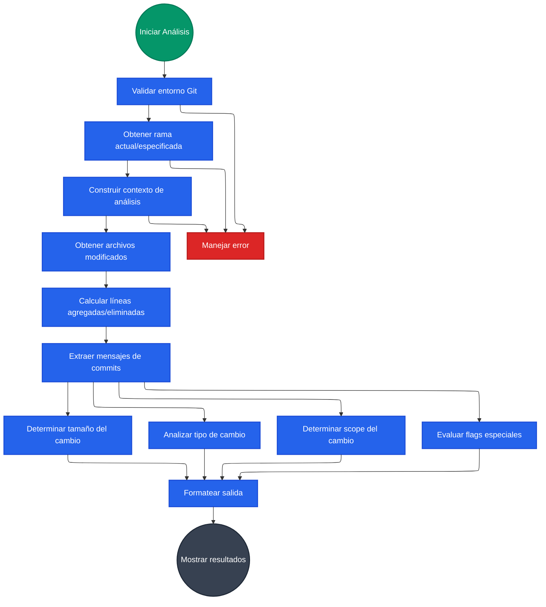
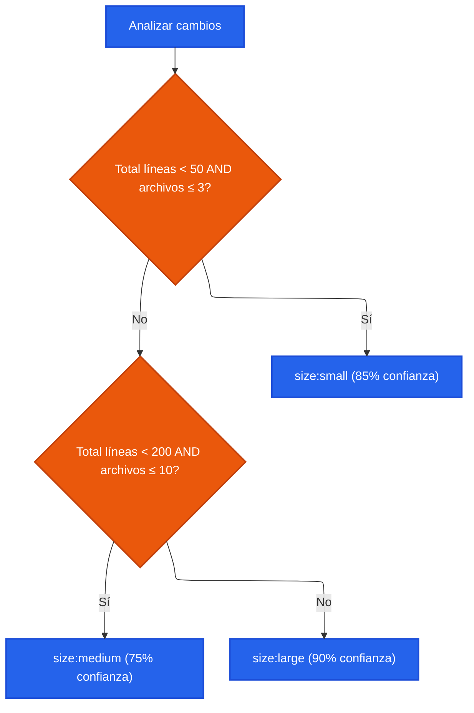
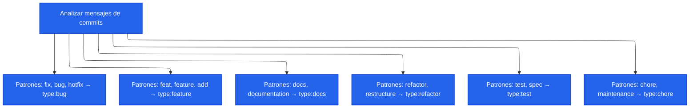
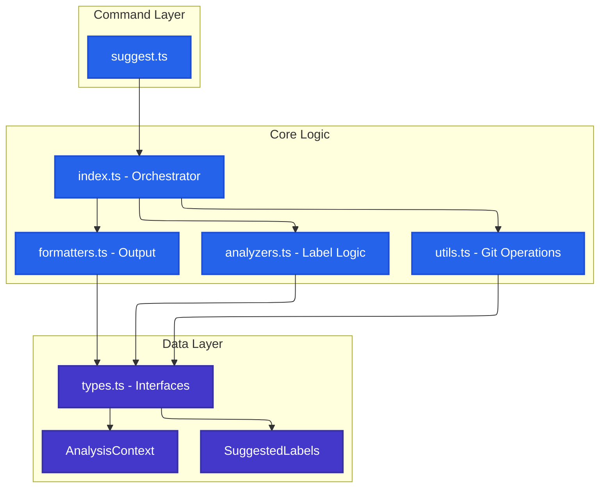

# Pull Request Labels Suggest

## Descripción

El comando `projex pull-request labels suggest` es una herramienta de análisis automático que examina cambios en git y sugiere labels apropiados para pull requests, ayudando a estandarizar la categorización y mejorar la organización del flujo de trabajo.

## Casos de Uso

Este comando es especialmente útil para:
- **Equipos de desarrollo** que buscan consistencia en el etiquetado de PRs
- **Pipelines de CI/CD** que necesitan categorización automática
- **Maintainers de proyectos** que revisan múltiples PRs diariamente
- **Automatización de GitHub Actions** para aplicar labels automáticamente

## Flujo de Análisis



## Algoritmo de Detección

### Análisis de Tamaño

El algoritmo evalúa el tamaño basándose en dos métricas principales:



### Análisis de Tipo



## Arquitectura de Componentes



## Formatos de Salida

### CSV (Automatización)
Ideal para scripts y pipelines:
```
size:large,type:feature,scope:api,dependencies-updated
```

### JSON (Análisis Detallado)
Proporciona información completa con confianza y metadatos:
```json
{
  "labels": [
    {
      "name": "size:medium",
      "confidence": 75,
      "description": "Medium change: 150 lines, 5 files"
    }
  ],
  "flags": {
    "breakingChange": false,
    "dependencies": true
  }
}
```

### Table (Revisión Visual)
Formato estructurado para revisión humana con códigos de color y organización clara.

## Integración con CI/CD

### GitHub Actions
```yaml
- name: Suggest PR Labels
  run: |
    LABELS=$(projex pull-request labels suggest --format csv)
    echo "suggested-labels=$LABELS" >> $GITHUB_OUTPUT
```

### Script de Automatización
```bash
#!/bin/bash
# Obtener labels sugeridos
LABELS=$(projex pull-request labels suggest --format csv)

# Convertir a array
IFS=',' read -ra LABEL_ARRAY <<< "$LABELS"

# Aplicar labels (ejemplo con gh CLI)
for label in "${LABEL_ARRAY[@]}"; do
  gh pr edit --add-label "$label"
done
```

## Configuración y Personalización

El comando detecta automáticamente:
- **Rama actual** si no se especifica `--branch`
- **Rama objetivo** con auto-detección inteligente (busca `main`, `master`, `develop`, `dev` en ese orden) o configurable con `--target`
- **Formato de salida** personalizable según el caso de uso

### Auto-detección de Rama Principal

El comando utiliza un algoritmo inteligente para detectar la rama principal del repositorio:

1. **Búsqueda local**: Verifica si existen ramas comunes (`main`, `master`, `develop`, `dev`) localmente
2. **Búsqueda remota**: Si no encuentra localmente, busca en `origin` remoto
3. **HEAD remoto**: Intenta obtener la rama por defecto desde `refs/remotes/origin/HEAD`
4. **Fallback**: Usa `main` como último recurso

Esto asegura compatibilidad con diferentes convenciones de naming:
- Repositorios modernos que usan `main`
- Repositorios legacy que usan `master`
- Flujos de trabajo que usan `develop` como rama principal
- Configuraciones personalizadas

## Consideraciones de Rendimiento

- **Análisis local**: No requiere conexión a APIs externas
- **Cache de git**: Utiliza comandos git nativos optimizados
- **Procesamiento eficiente**: Análisis en memoria sin archivos temporales
- **Escalabilidad**: Funciona eficientemente con repositorios grandes

## Limitaciones Conocidas

1. **Dependencia de Git**: Requiere repositorio git válido
2. **Mensajes de commit**: La calidad del análisis depende de mensajes descriptivos
3. **Patrones de archivos**: Reconoce patrones comunes pero puede necesitar ajustes para proyectos específicos
4. **Idioma**: Optimizado para mensajes en inglés, soporte limitado para otros idiomas
