# VTEX Workflows Management

## Descripción

Los comandos VTEX de projex-toolbet automatizan flujos de trabajo comunes en el ecosistema VTEX, incluyendo autenticación, gestión de archivos CMS, y ejecución de comandos con aprobación automática para entornos de CI/CD.

## Casos de Uso

- **Autenticación automática** en pipelines de CI/CD
- **Backup y deploy de archivos CMS** para staging y producción
- **Ejecución no interactiva** de comandos VTEX
- **Gestión de múltiples cuentas** VTEX
- **Automatización de scripts** desde manifest.json

## Arquitectura de Autenticación VTEX

```mermaid
%%{init: { "flowchart": { "defaultRenderer": "elk" } } }%%
flowchart TB
    classDef statementClass fill:#2563eb,color:white,stroke:#1d4ed8,stroke-width:2px
    classDef conditionalClass fill:#ea580c,color:white,stroke:#c2410c,stroke-width:2px
    classDef inicioClass fill:#059669,color:white,stroke:#047857,stroke-width:2px
    classDef finClass fill:#374151,color:white,stroke:#1f2937,stroke-width:2px
    classDef amazonClass fill:#7c3aed,color:white,stroke:#6d28d9,stroke-width:2px
    classDef dbClass fill:#4338ca,color:white,stroke:#3730a3,stroke-width:2px

    inicio(("Iniciar Login")):::inicioClass
    credenciales["Solicitar API Key y Token"]:::statementClass
    validar["Validar credenciales"]:::statementClass
    request["POST /api/vtexid/apptoken/login"]:::amazonClass
    response{"¿Login exitoso?"}:::conditionalClass
    guardar["Guardar token en config VTEX"]:::statementClass
    config[(VTEX Config File)]:::dbClass
    fin(("Autenticación Lista")):::finClass
    error["Error de autenticación"]:::rejectClass

    inicio --> credenciales
    credenciales --> validar
    validar --> request
    request --> response
    response -->|Sí| guardar
    response -->|No| error
    guardar --> config
    config --> fin
```



## Flujo de Gestión CMS

### Backup de Archivos


### Deploy de Archivos


## Sistema de Ejecución Automática

### Auto-approval de Comandos


## Gestión de Scripts con manifest.json

### Estructura de Scripts
```json
{
  "name": "my-vtex-app",
  "version": "1.0.0",
  "scripts": {
    "build": "vtex build",
    "deploy": "vtex deploy --yes",
    "publish": "vtex publish --force",
    "test:e2e": "cypress run",
    "setup:dev": "vtex use workspace dev --production false"
  }
}
```

### Fallback a package.json

```mermaid
%%{init: { "flowchart": { "defaultRenderer": "elk" } } }%%
flowchart TB
    classDef statementClass fill:#2563eb,color:white,stroke:#1d4ed8,stroke-width:2px
    classDef conditionalClass fill:#ea580c,color:white,stroke:#c2410c,stroke-width:2px
    classDef dbClass fill:#4338ca,color:white,stroke:#3730a3,stroke-width:2px

    buscar["Buscar script solicitado"]:::statementClass
    manifest{"¿Existe en manifest.json?"}:::conditionalClass
    package{"¿Existe en package.json?"}:::conditionalClass
    ejecutar_manifest["Ejecutar desde manifest"]:::statementClass
    ejecutar_package["Ejecutar desde package"]:::statementClass
    error["Script no encontrado"]:::rejectClass
    
    manifest_db[(manifest.json)]:::dbClass
    package_db[(package.json)]:::dbClass

    buscar --> manifest
    manifest -->|Sí| ejecutar_manifest
    manifest -->|No| package
    package -->|Sí| ejecutar_package
    package -->|No| error
    
    ejecutar_manifest --> manifest_db
    ejecutar_package --> package_db
```


## Arquitectura de Componentes VTEX


## Casos de Uso en CI/CD

### Pipeline de Deployment
```yaml
# GitHub Actions ejemplo
name: VTEX Deploy
on:
  push:
    branches: [main]

jobs:
  deploy:
    runs-on: ubuntu-latest
    steps:
      - uses: actions/checkout@v3
      
      - name: Install projex
        run: npm install -g projex
        
      - name: VTEX Login
        env:
          VTEX_API_KEY: ${{ secrets.VTEX_API_KEY }}
          VTEX_API_TOKEN: ${{ secrets.VTEX_API_TOKEN }}
          VTEX_ACCOUNT: ${{ secrets.VTEX_ACCOUNT }}
        run: projex vtex login
        
      - name: Backup Current State
        run: projex vtex cms backup
        
      - name: Deploy Changes
        run: projex vtex cms deploy --yes
        
      - name: Run Tests
        run: projex vtex run-script test:e2e
```

### Automatización de Scripts
```bash
#!/bin/bash
# Script de deployment completo

echo "🔑 Autenticando en VTEX..."
projex vtex login

echo "💾 Creando backup..."
projex vtex cms backup

echo "🏗️ Ejecutando build..."
projex vtex run-script build

echo "🚀 Deploying aplicación..."
projex vtex run-script deploy

echo "✅ Deployment completado"
```

## Manejo de Errores y Validación

### Errores Comunes y Soluciones

1. **Authentication Failed**
   - Verificar API Key y Token
   - Validar permisos de cuenta
   - Regenerar credenciales si es necesario

2. **File Upload Errors**
   - Verificar estructura de archivos
   - Validar permisos de escritura
   - Comprobar límites de tamaño

3. **Script Execution Errors**
   - Verificar existencia del script
   - Validar dependencias
   - Comprobar workspace activo

### Sistema de Logging


## Mejores Prácticas

### Seguridad
- **Variables de entorno**: Nunca hardcodear credenciales
- **Rotación de tokens**: Regenerar API tokens regularmente
- **Permisos mínimos**: Usar cuentas con permisos específicos

### Performance
- **Backup incremental**: Solo archivos modificados
- **Batch operations**: Agrupar operaciones similares
- **Timeout handling**: Configurar timeouts apropiados

### Monitoring
- **Log centralizado**: Usar herramientas de logging
- **Health checks**: Verificar estado de servicios
- **Alertas**: Configurar notificaciones de errores

### Desarrollo
- **Testing local**: Usar workspaces de desarrollo
- **Staging**: Validar en ambiente de pruebas
- **Rollback**: Mantener estrategia de reversión
